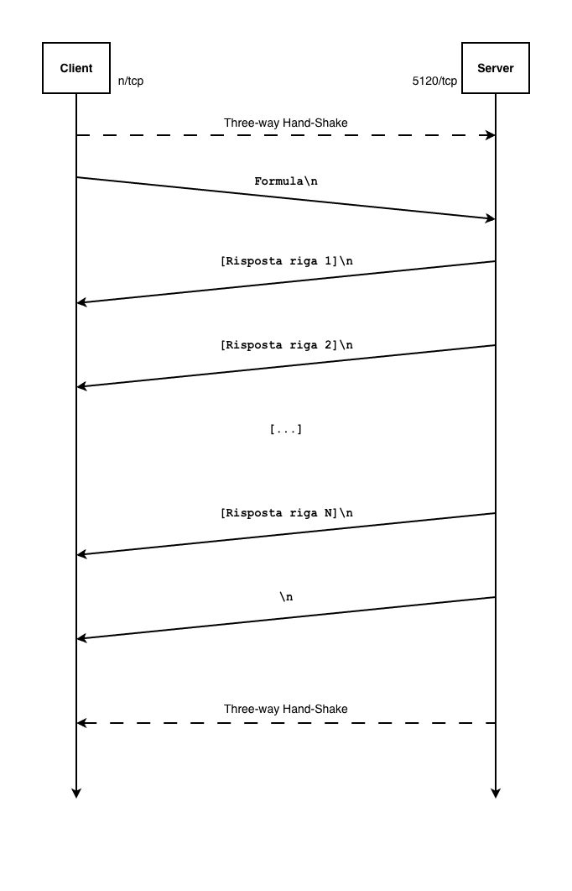

# AnalisiChimica - Sistema Client/Server per Analisi Chimiche

## Descrizione
AnalisiChimica è un'applicazione Client/Server in linguaggio Java che permette di analizzare formule chimiche e calcolare la composizione percentuale in massa di ciascun elemento presente in un composto.

## Funzionalità Principali

Le funzionalità principali del software sono:

- **Analisi formule chimiche di base** (es: H2O, H2SO4, CaCl2)
- **Calcolo percentuale di massa** per ogni elemento
- **Validazione sintattica** automatica delle formule
- **Architettura client/server** con supporto multithreading
- **Gestione tavola periodica** da file CSV

## Componenti del Sistema

### `AnalisiChimicaServer.java`

Il file implementa il modulo server dell'applicazione che è in grado di gestire fino a 4 connessioni simultanee sulla porta **5120/tcp** su cui rimane in ascolto a ciclo continuo.

Il server esegue sempre la validazione dei dati ricevuti e fornisce una risposta contente i risultati della sua elaborazione o un messaggio di errore.

### `AnalisiChimicaClient.java`

Il file implementa il modulo client dell'applicazione che fornisce all'utente un'interfaccia text-based che guida l'utente nell'interazione con il server.

È prevista una forma di validazione dei dati lato client che impedisce l'invio di formule con sintassi non valida.

### `Elemento.java`

La classe è usata per rappresentare un elemento chimico tramite:
- ID
- Simbolo
- Nome
- Peso atomico standard

Questi dati sono memorizzati secondo il seguente tracciato:
```
ID;Simbolo;Nome;Peso
```
nel file `elementiChimici.csv`

## Diagramma temporale



## Crediti

Questo software è stato realizzato da Lorenzo Porta - Matricola 12778
Classe 5FIN - A.S. 2025/2026 - ITT "G. Fauser" - Novara
